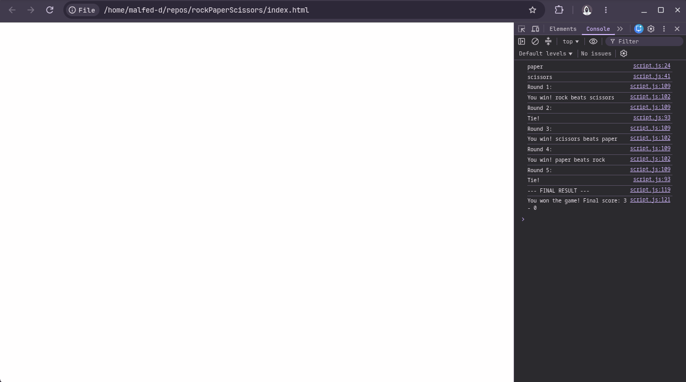

# 🪨 📄 ✂️ Rock Paper Scissors

A simple implementation of the classic Rock Paper Scissors game, built as part of **The Odin Project (TOP)** Fundamentals path.

## 📝 Project Overview
This project is a console-based game where a human player competes against the computer. The game tracks scores over 5 rounds and declares an overall winner at the end.

### 🚀 Features
- **Randomized Computer Choice**: The computer randomly selects Rock, Paper, or Scissors.
- **User Input**: Uses `prompt()` to capture player choices.
- **Case-Insensitivity**: Players can enter "ROCK", "rock", or "RocK" and it will still work.
- **Score Tracking**: Maintains a running score for both the human and the computer.
- **5-Round Match**: The game automatically iterates through 5 rounds using a loop.

## 📸 Screenshot

## 🛠️ How to Run
1. Clone this repository.
2. Open `index.html` in any modern web browser.
3. Open the **Browser Console** (Right-click $\rightarrow$ Inspect $\rightarrow$ Console) to play the game and see the results.

## 🧠 What I Learned
Through this project, I practiced several core JavaScript concepts:
- **Functions**: Creating reusable blocks of logic.
- **Randomness**: Using `Math.random()` and `Math.floor()` to generate choices.
- **Conditionals**: Using `if/else` statements to determine the winner of each round.
- **Scope**: Understanding global vs. local scope by encapsulating the game logic inside a `playGame` function.
- **Loops**: Using a `for` loop to repeat the game rounds efficiently.

---
*Created as part of the Foundations path of The Odin Project.*